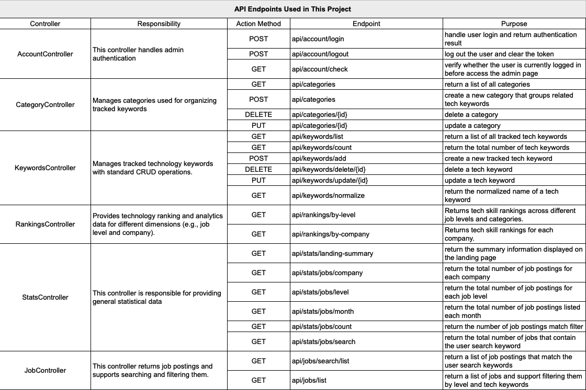

# StackRadar

## 1. Overview  

StackRadar is a full-stack web platform that helps junior developers in New Zealand understand in-demand tech stacks and filter jobs based on their skills.

## 2. Live Demo & Screenshots  

### 2.1 Live Site 

[Visit StackRadar Online](https://www.stackradar.me)

### 2.2 Screenshot: 


## 3. About

Curious about the origin of this project?  
👉 [**Read the full story behind StackRadar**](./docs/TheStoryBehindStackRadar.md)

## 4. System Architecture

The diagram below shows how frontend, backend, web scraping, and database interact in the system


## 5. Project Structure & Folder Layout

StackRadar consists of four main modules:

- `python_scraper`: Collects and processes real job data, stores it in PostgreSQL
- `model_pipeline`: Performs job-level classification using text embeddings and an MLP classifier
- `01_backend`: ASP.NET Core web API that exposes clean, preprocessed job and tech-stack ranking data to frontend
- `02_frontend`: Frontend that fetches API data and visualizes job and tech-stack rankings insights

### 5.1 Data Flow

The data flows through the pipeline:  
**scraper → database → backend API → frontend UI**  
This makes the app fully data-driven

### 5.2 Directory Structure

```bash
STACKTRENDS.COM/
├── 01_backend/                  # ASP.NET Core Web API (C#)
├── 02_frontend/                 # HTML + Tailwind CSS + Javascript (to be migrated to React)
├── python_scraper/              # Python scripts for scraping and data preprocessing
├── scraper_entry.py             # Entry point for running the job data scraper and processing the data
├── model_pipeline/              # Job level classification built with text embeddings + MLP
├── docs                         # Supporting files and assets for the README.md
├── README.md
└── StackTrends.sln      
```

## 6. Backend API Overview



## 7. Tech Stack Used in StackRadar

- **Frontend**: JavaScript, HTML, Tailwind CSS (will be migrated to React)
- **Backend**: C# · ASP.NET Core Web API (RESTful)
- **Data pipeline**: Python + Requests → GraphQL API → ETL Pipeline → Data Cleaning & Processing → PostgreSQL on Azure
- **Model pipeline**: Sentence Embeddings → PyTorch → MLP Classifier
- **Cloud**: Azure (App Service, Static Web App, Azure Database for PostgreSQL)


