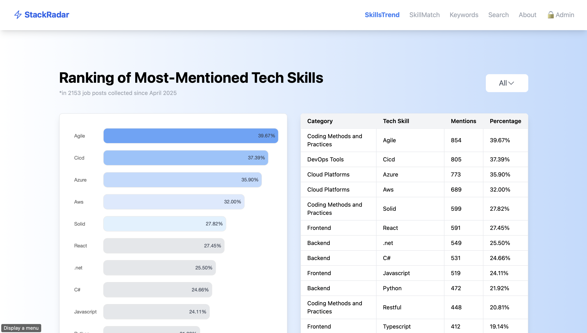
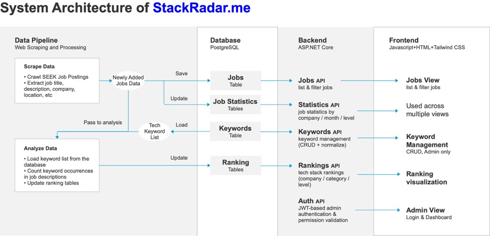

# StackRadar

StackRadar is a full-stack web platform that helps junior developers in New Zealand understand in-demand tech stacks and filter jobs based on their skills.

### Live Site  
[Visit StackRadar Online](https://www.stackradar.me)

### Screenshot: 




## About

Curious about the origin of this project?  
👉 [**Read the full story behind StackRadar**](./docs/TheStoryBehindStackRadar.md)

## Tech Stack

- **Frontend**: JavaScript, HTML, Tailwind CSS (will be migrated to React)
- **Backend**: C# with ASP.NET Core Web API (RESTful architecture)  
- **Data Collection**: Python + BeautifulSoup scraping
- **Database**: PostgreSQL on Azure
- **Cloud**: Azure(App Service + Static Web App)

## System Architecture

The diagram below shows how frontend, backend, web scraping, and database interact in the system



## Project Structure & Modules

This project is divided into three main modules:

- `python_scraper`: Collects and processes real job data, stores it in PostgreSQL
- `01_backend`: Serves preprocessed data to frontend via REST API
- `02_frontend`: Fetches and visualizes job/tech stack data in a user-friendly UI

The data flows through the pipeline:  
**scraper → database → backend API → frontend UI**  
This makes the app fully data-driven and easy to maintain.

## 📁 Folder Overview

```bash
STACKTRENDS.COM/
├── 01_backend/                  # ASP.NET Core Web API (C#)
├── 02_frontend/                 # HTML + Tailwind CSS + Javascript (to be migrated to React)
├── python_scraper/              # Python scripts for scraping and data preprocessing
├── scraper_entry.py             # Entry point for daily job scraping
├── TheStoryBehindStackRadar.md  # Full project background and story
├── README.md
└── StackTrends.sln      

