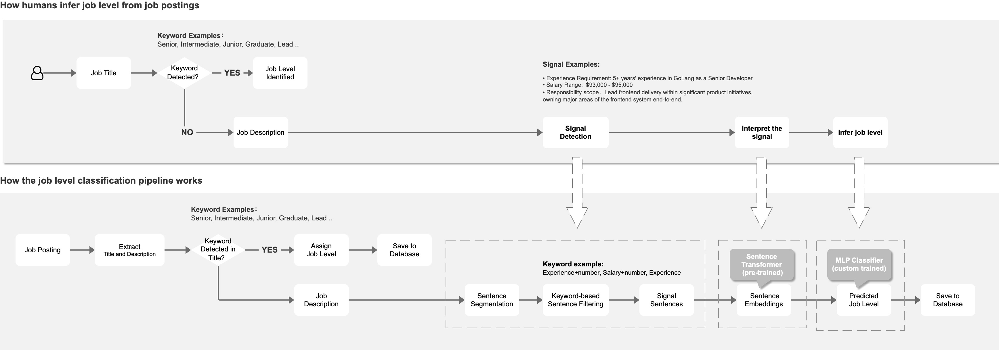
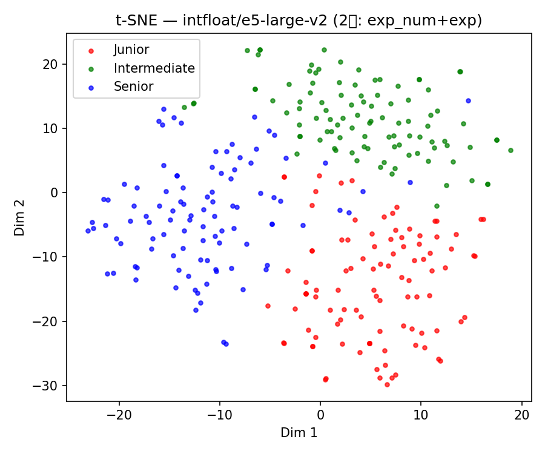

# 1. Project Overview  

StackRadar is designed to quantify technology demand in the New Zealand job market and visualize these insights through a full-stack web application. It aims to help developers make more informed learning decisions.


# 2. Live Demo & Screenshots  

1️⃣ **Live Site**

Click the link below to visit StackRadar

[Visit StackRadar Online](https://www.stackradar.me)

2️⃣ **Screenshot**


# 3. Tech Stack Used

- **Frontend**: JavaScript, HTML, Tailwind CSS
- **Backend**: C# · ASP.NET Core Web API (RESTful)
- **Data pipeline**: Python, Requests, BeautifulSoup, Pandas
- **Database**: PostgreSQL (Azure Database for PostgreSQL)
- **Classification pipeline**: Sentence Transformers (embeddings), PyTorch MLP classifier
- **Cloud**: Azure (App Service, Static Web App)


# 4. Technical Implementation

## 4.1 System Overview 

The system consists of three main components: 
- a data pipeline that collects and processes publicly available job posting data
- a multi-step job level classification pipeline that predicts job seniority, which is implemented in the data enrichment stage
- a web-based application that visualizes technology demand insights and supports user interaction.

The following diagram illustrates how these components interact within the system.


## 4.2 Backend API Overview


## 4.3 Job Level Classification Pipeline

### 4.3.1 Pipeline Overview

This pipeline simulates human reasoning to predict the job level for each posting, using a hybrid approach that combines rule-based logic and machine learning. The pipeline consists of two main stages:

- a rule-based keyword matching method applied to job titles to directly assign job levels when possible
- an embedding-based machine learning pipeline that extracts key information from job descriptions and predicts job levels using sentence embeddings and an MLP classifier



### 4.3.2 Model Performance

#### 1) Embedding Quality

##### 1️⃣ Metrics

The table below shows the best embedding quality I achieved, measured by the Silhouette Score and Calinski–Harabasz Score. These metrics measure how well points cluster within the same group and how well different groups are separated.

| Metric                    | Score |
|--------------------------|-------|
| Silhouette Score         | 0.065 |
| Calinski–Harabasz Score  | 17.2  |

##### 2️⃣ Visualization

The scatter plot below shows how the embeddings are distributed in a 2D space after dimensionality reduction (e.g., PCA or t-SNE). From this visualization, we can roughly observe three clusters forming, each corresponding to a job level. Points from the same level tend to group together, while different levels are relatively well separated, although some overlap still exists.



##### 3️⃣ Method

This was achieved using the pretrained model **e5-large-v2**, with input sentences that contain both the keyword "experience" and a number, falling back to sentences containing the keyword "experience" if none are found.

#### 2）Classification Performance

The model achieves strong overall performance on the test set:

- Accuracy: **0.90**
- F1 Score (weighted): **0.90**  
- F1 Score (macro): **0.87**  

It performs particularly well on senior and intermediate roles.  
Performance on junior roles is slightly lower, likely due to the smaller number of samples.

# 5. Project Structure

```bash
STACKTRENDS.COM/
├── 01_backend/                  # ASP.NET Core Web API serving processed job data and analytics results
├── 02_frontend/                 # Web frontend that visualizes job listings and technology demand insights
├── python_scraper/              # Data pipeline for collecting and processing job posting data
├── scraper_entry.py             # Entry point for running the data collection and processing pipeline
├── model_pipeline/              # Job level classification pipeline used in the data enrichment stage
├── docs                         # Supporting files and assets for the README.md
├── README.md
└── StackTrends.sln      
```


