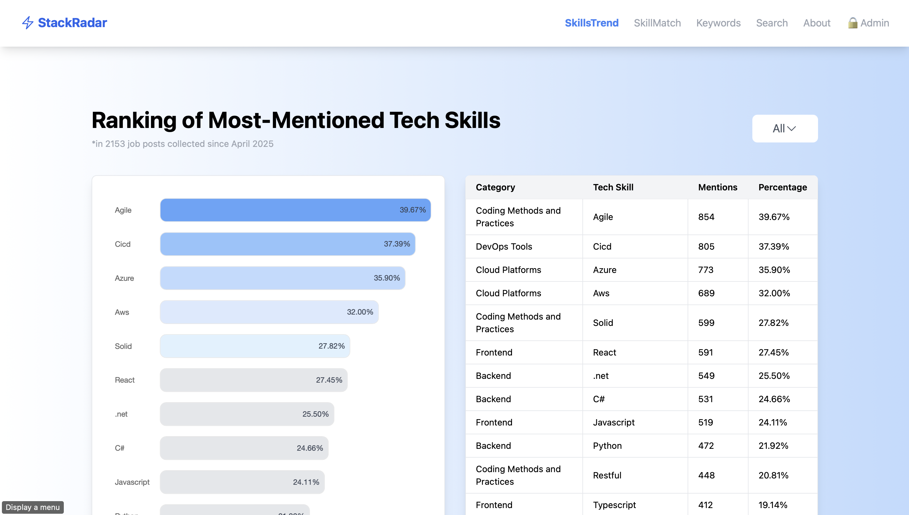
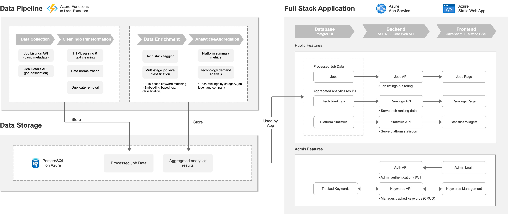
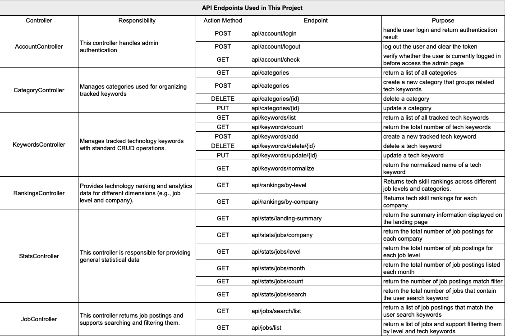

# StackRadar

## 1. Project Overview  

StackRadar is designed to quantify technology demand in the New Zealand job market and visualize these insights through a full-stack web application. It aims to help developers make more informed learning decisions.

## 2. Live Demo & Screenshots  

### 2.1 Live Site 

[Visit StackRadar Online](https://www.stackradar.me)

### 2.2 Screenshot: 




## 3. System Overview

The system consists of three main components: 
- a data pipeline that collects and processes publicly available job posting data
- a multi-step job level classification pipeline that predicts job seniority, which is implemented in the data enrichment stage
- a web-based application that visualizes technology demand insights and supports user interaction.

The following diagram illustrates how these components interact within the system.



## 4. Backend API Overview



## 5. Job Level Classification Pipeline

TBD

## 6. Project Structure

```bash
STACKTRENDS.COM/
├── 01_backend/                  # ASP.NET Core Web API serving processed job data and analytics results
├── 02_frontend/                 # Web frontend that visualizes job listings and technology demand insights
├── python_scraper/              # Data pipeline for collecting and processing job posting data
├── scraper_entry.py             # Entry point for running the data collection and processing pipeline
├── model_pipeline/              # Job level classification pipeline used in the data enrichment stage
├── docs                         # Supporting files and assets for the README.md
├── README.md
└── StackTrends.sln      
```

## 7. Tech Stack Used in StackRadar

- **Frontend**: JavaScript, HTML, Tailwind CSS
- **Backend**: C# · ASP.NET Core Web API (RESTful)
- **Data pipeline**: Python, Requests, BeautifulSoup, Pandas
- **Database**: PostgreSQL (Azure Database for PostgreSQL)
- **Classification pipeline**: Sentence Transformers (embeddings), PyTorch MLP classifier
- **Cloud**: Azure (App Service, Static Web App)


