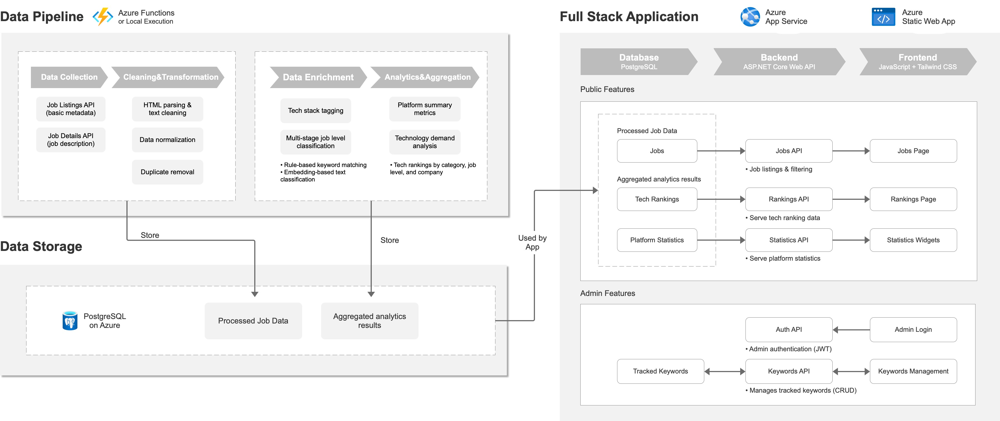

# StackRadar

## 1. The Problems

StackRadar is a data-driven application built on more than 6,000 real-world job postings. It is designed to address two main real-world problems faced by IT students and job seekers.

### 1.1 Problem 1

There is a gap between the technical skills students learn at university and those employers are actually looking for. Students need clearer insight into employer expectations so they can make better-informed learning decisions outside of their coursework and prepare more effectively for the job market.

### 1.2 Problem 2

Job seekers have to spend a significant amount of time reviewing job descriptions just to determine whether a role is suitable for them. Many roles eventually turn out not to be a good match because either the technical requirements or the seniority level do not fit their background, but job seekers often do not realize this until they have already spent time reading the full job description.

## 2. The Solutions

A data pipeline provides the foundation for solving both problems. It collects real-world job postings, cleans and transforms the raw data, enriches each posting with structured information, and stores the processed results in a database for downstream analysis and use. The same data then powers both the technology-demand insights and the job-screening features delivered through the full-stack application. The diagram below shows how data moves from collection and processing to storage, backend APIs, and the frontend.

### 2.1 Solution 1: Data-Driven Technology Demand Insights

StackRadar identifies and normalizes technical skills mentioned in more than 6,000 real-world job postings, analyzes how frequently each skill appears, and visualizes technology demand across different job levels, companies, and technology categories. This helps students understand which technical skills employers are actually looking for and make better-informed learning decisions based on real job-market data.

### 2.2 Solution 2: AI-Powered Job Screening

StackRadar uses an LLM to analyze job descriptions and extract key requirements, including required technical skills, years of experience, job level, and supporting evidence. Job seekers can view each role’s technical requirements and seniority level at a glance, allowing them to quickly filter out unsuitable roles without reading every full job description first.

Beyond the LLM-powered workflow, I also built a two-stage job-level classification pipeline designed to imitate how humans infer seniority from a job posting. The pipeline first checks the job title for explicit seniority keywords. If no clear level is identified, it extracts relevant signals from the job description, converts them into sentence embeddings using a pretrained Sentence Transformer, and passes the embeddings to a custom-trained MLP classifier to predict the job level.

## 3. Tech Stack Used

- **LLM:** OpenAI API, LLM Integration, Prompt Engineering, Structured Data Extraction
- **Natural Language Processing:** Sentence Transformers, Text Embeddings, Text Classification, Keyword-Based Sentence Filtering
- **Machine Learning:** PyTorch, MLP Classifier, Classification Pipelines, Model Evaluation
- **Data & Cloud:** Python, Pandas, ETL Pipelines, Data Processing, PostgreSQL, Azure
- **Programming & Web:** C#, JavaScript, ASP.NET Core Web API, REST APIs, Tailwind CSS
