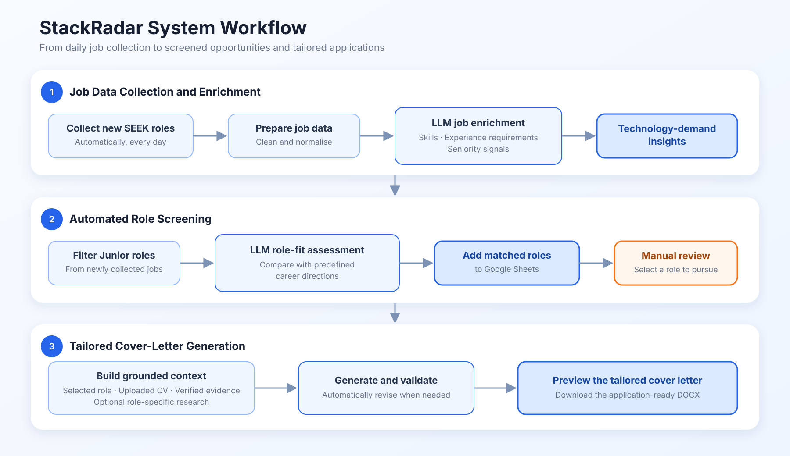
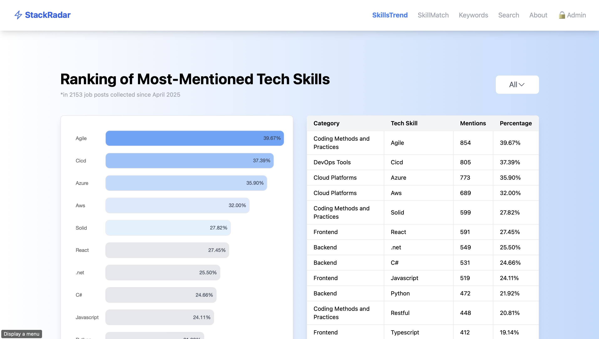
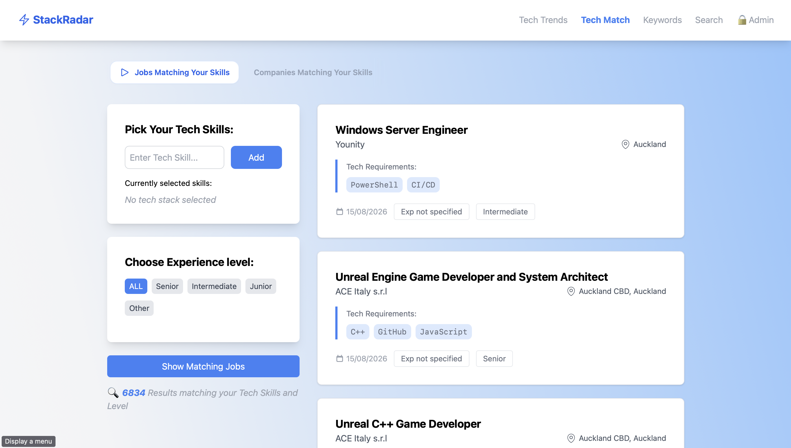
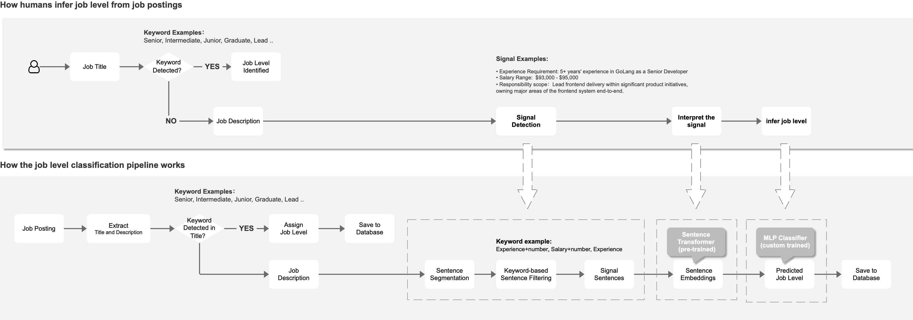

# StackRadar

## 1. Overview

StackRadar is a personal AI-powered job search system for early-career AI and software roles in New Zealand. It collects new SEEK listings each day, enriches job descriptions, and aggregates technology mentions into market-demand insights. An LLM screens new Junior roles against predefined career directions—Computer Vision, Machine Learning, and AI Automation—and records matching roles in Google Sheets for manual follow-up. Selected roles can then flow into a cover-letter generator that combines the job requirements with an uploaded CV, verified candidate and project context, and optional role-specific research to generate and validate a tailored DOCX draft.

**[Try StackRadar Live →](https://www.stackradar.me)**

## 2. Problem Statement

Early-career technology job seekers face three connected challenges:

1. **Understanding the market** — There is often a gap between the technical skills taught at university and those employers are actually looking for. Without clear evidence of current job-market demand, students may struggle to understand employer expectations and decide which skills to learn next.
2. **Finding relevant opportunities** — For many job seekers, a typical day involves checking multiple job platforms for new roles and assessing the suitability of each one. This is a highly repetitive and time-consuming process, especially when technical, experience, and seniority requirements are buried in full job descriptions.
3. **Preparing a tailored application** — Writing a tailored cover letter for every application is another repetitive and time-consuming task. Job seekers must repeatedly analyse each job description, identify their most relevant experience, and adapt their core story to the role.

StackRadar brings these stages together in one connected system: understand demand, identify worthwhile opportunities, and prepare a tailored application.

## 3. System Workflow



Together, these stages transform newly collected job postings into technology-demand insights, a shortlist of relevant roles for manual review, and tailored cover letters grounded in verified candidate evidence.

## 4. Features

### 4.1 Technology Market Intelligence

StackRadar identifies and normalises technical skills mentioned across more than 6,000 real-world job postings. It analyses how frequently each technology appears and presents demand across job levels, companies, technology categories, and time periods.

This helps users:

- understand which technologies employers are actively requesting;
- compare demand across Junior, Intermediate, and Senior roles;
- explore the technology profiles of different companies;
- identify growing and declining technologies; and
- make better-informed learning and career-development decisions.



### 4.2 Automated Job Screening

An LLM analyses job descriptions to identify key requirements such as technical skills, experience expectations, and seniority signals, then evaluates newly collected Junior roles against predefined career directions—Computer Vision, Machine Learning, and AI Automation. Relevant roles are added to a Google Sheets tracking list for manual follow-up and can also be selected directly in the cover-letter generator.



### 4.3 Tailored Cover Letter Generation

Once a relevant role has been identified, an LLM generates a tailored cover letter by connecting the role's requirements with evidence from the candidate's CV and verified project experience. The draft is automatically checked against predefined writing rules, then presented for review and DOCX download.


## 5. How StackRadar Uses AI

StackRadar's AI layer combines LLM-based workflows with a hybrid machine-learning pipeline, using each approach for different types of analysis.

**LLM workflows:** LLMs interpret unstructured job descriptions, extract structured requirements, evaluate Junior roles against predefined career directions, gather additional role-specific context when requested, and generate tailored cover letters from verified candidate evidence.

**Machine-learning pipeline:** The job-level classification pipeline is designed around how people typically infer a role's seniority. It first looks for explicit level terms in the job title. When the title is inconclusive, relevant contextual signals from the job description are converted into sentence embeddings and classified by a custom-trained MLP model.



## 6. Tech Stack

**LLM / NLP:** OpenAI API, structured LLM outputs, prompt engineering, Sentence Transformers, text embeddings

**Machine Learning:** PyTorch, custom MLP classifier, PCA and t-SNE evaluation

**Data Pipeline:** Python, Pandas, Beautiful Soup, automated ETL and enrichment workflows

**Backend:** C#, .NET 8, ASP.NET Core Web API, JWT authentication

**Frontend:** JavaScript, HTML, Tailwind CSS

**Data and Cloud:** PostgreSQL, Azure Functions, Azure App Service, Azure Static Web Apps

**Document Processing:** Open XML SDK, DOCX text extraction and generation

## 7. Project Structure

```text
StackTrend/
├── 01_backend/                  # ASP.NET Core APIs and cover-letter services
├── 02_frontend/                 # Browser-based user interface
├── python_scraper/              # Collection, enrichment, analytics, and screening pipeline
├── model_pipeline/              # Job-level model training and experiments
├── tests/                       # Python pipeline tests
├── docs/                        # Screenshots, diagrams, and project documentation
└── scraper_entry.py              # End-to-end pipeline entry point
```

## 8. Limitations and Future Work

StackRadar is currently personalised around a single candidate profile and a predefined set of career directions. To generalise the system for other job seekers, candidate context, screening criteria, and cover-letter preferences could be moved into user-managed profiles. Application tracking could also be added to extend the workflow beyond opportunity discovery and document preparation.

The current dataset focuses on New Zealand technology roles, so its market insights reflect this geographic and occupational context.

## 9. Demo

Explore technology demand, discover relevant roles, and generate a tailored application through one connected workflow:

**[Try StackRadar Live →](https://www.stackradar.me)**

## 10. License

This project is available under the terms of the [LICENSE](./LICENSE) file.
